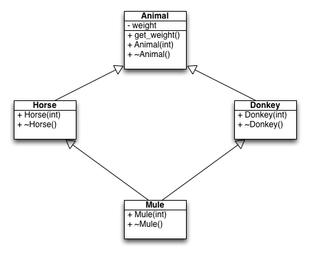

# Mule
## Description
A mule is a cross between a horse and a donkey. As we all know, horses, donkeys
and mules are all animals. Given the relationship between the following
classes, please implement them.


## Sample Input
```
  Horse *a = new Horse(500);  
  Donkey *b = new Donkey(300);  
  Mule *c = new Mule(100);  
  cout << a->get_weight() << endl;  
  cout << b->get_weight() << endl;  
  cout << c->get_weight() << endl;  
  delete a;  
  cout << endl;  
  delete b;  
  cout << endl;  
  delete c;  
  cout << endl;  
```

## Sample Output
```
500  
300  
100  
Horse destructed!  
Animal destructed!  
```
  
```
Donkey destructed!  
Animal destructed!  
```
  
```
Mule destructed!  
Donkey destructed!  
Horse destructed!  
Animal destructed!  
```
